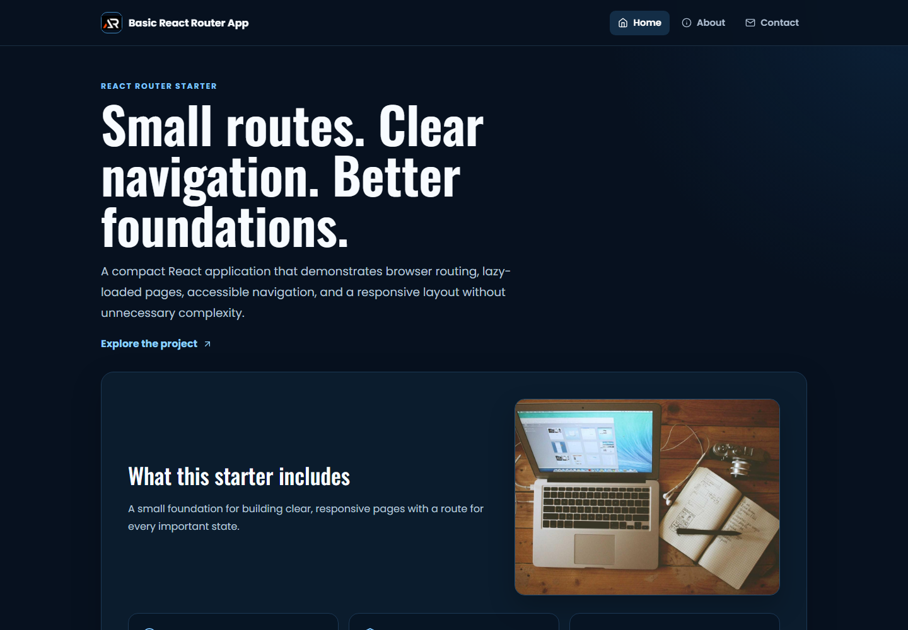

# Basic React Router App

A practical React Router starter that demonstrates clear route-based navigation, lazy-loaded pages, accessible controls, and a responsive static frontend layout.



## Features

- BrowserRouter routes for home, about, contact, legal pages, and not found states
- Lazy-loaded pages with a Suspense loading state
- Fixed header with scroll-aware visibility and a mobile navigation drawer
- Route scroll reset, keyboard support, focus states, and GitHub Pages fallback
- Local favicon, logo, social preview, and feature image assets

## Tech Stack

- React 18
- React Router DOM
- Vite
- styled-components
- React Icons

## Setup

```bash
npm install
npm run dev
```

Open the repository base path shown by Vite, usually `/basic-react-router-app/`.

Production checks and deployment:

```bash
npm run lint
npm run build
npm run preview
npm run deploy
```

## Future Prospects

- Add more reusable route examples and nested layouts
- Add small form and data-fetching demos
- Add theme preferences and richer page transitions

## Images

- `screenshot.png` - current home-screen screenshot
- `public/router-pattern.jpg` - local feature panel image
- `public/preview.png` - social sharing preview
- `public/logo.png` - application logo
- `public/favicon.ico` - browser favicon

## License

MIT License

## Links

- Portfolio: [https://www.ashishranjan.net/](https://www.ashishranjan.net/)
- GitHub: [https://github.com/a2rp](https://github.com/a2rp)
- CodePen: [https://codepen.io/ash1198](https://codepen.io/ash1198)
- LinkedIn: [https://www.linkedin.com/in/aashishranjan](https://www.linkedin.com/in/aashishranjan)
- Facebook: [https://www.facebook.com/theash.ashish/](https://www.facebook.com/theash.ashish/)
- YouTube: [https://www.youtube.com/@ashishranjan-ashz?sub_confirmation=1](https://www.youtube.com/@ashishranjan-ashz?sub_confirmation=1)
- Email: [ash.ranjan09@gmail.com](mailto:ash.ranjan09@gmail.com)

## Support

- Support: [https://a2rp-donation-page.netlify.app/](https://a2rp-donation-page.netlify.app/)
- Buy Me A Coffee: [https://buymeacoffee.com/a2rp](https://buymeacoffee.com/a2rp)
- Patreon: [https://patreon.com/a2rp](https://patreon.com/a2rp)
